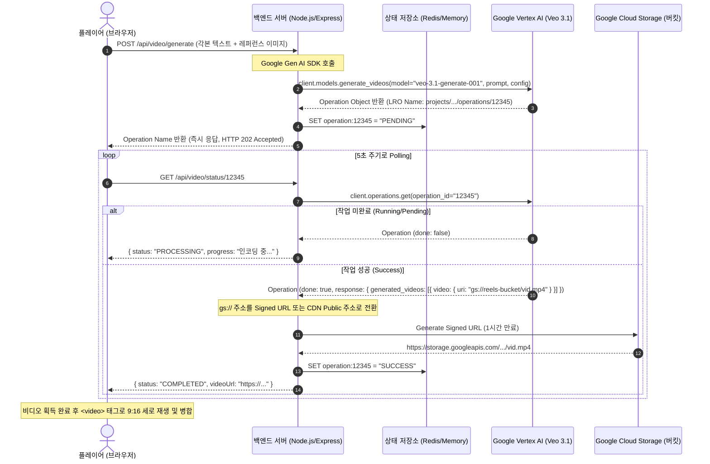

# Google Veo 3.1 비디오 생성 모델 통합 설계 명세서 (Architectural Blueprint)

이 설계 명세서는 **릴드(Reels Drama)**의 9:16 숏폼 콘텐츠 퀄리티를 극대화하기 위해, 기존의 스틸 이미지 줌인(Ken Burns) 방식에서 한 단계 나아가 Google의 세계 최고 수준 비디오 생성 모델인 **Google Veo 3.1 (veo-3.1-generate-001)**을 연동하는 구체적이고 즉시 구현 가능한 시스템 아키텍처 및 코드를 명시합니다.

---

## 1. 시스템 개념 및 아키텍처 (System Architecture)

비디오 생성(Text-to-Video / Image-to-Video)은 긴 시간(평균 1~3분)이 소요되는 무거운 비동기 작업(Long-Running Operation)입니다. 브라우저에서 직접 API Key를 통해 대기하는 것은 HTTP 타임아웃과 브라우저 마비, 그리고 GCP 크레덴셜 노출 위험이 있으므로 **Node.js 백엔드 서버(Express)**를 미들웨어로 두고 **Polling Queue** 아키텍처를 적용합니다.



---

## 2. 백엔드 구현 스펙 (Node.js Express & `@google/genai`)

백엔드는 Google Cloud IAM 인증 권한(서비스 계정 키 또는 Vertex AI User 권한)을 안전하게 상속받아 `@google/genai` 정식 SDK를 사용해 Veo 모델을 제어합니다.

### 2.1 의존성 설치
```bash
npm install express @google/genai dotenv cors redis
```

### 2.2 Express 백엔드 코드 (`server.js`)
```javascript
import express from 'express';
import { GoogleGenAI } from '@google/genai';
import cors from 'cors';
import dotenv from 'dotenv';

dotenv.config();

const app = express();
app.use(cors());
app.use(express.json());

// Google Gen AI SDK 초기화 (GCP 서비스 계정 크레덴셜 자동 주입)
const ai = new GoogleGenAI();

// 1. 비동기 비디오 생성 요청 엔드포인트
app.post('/api/video/generate', async (req, res) => {
  try {
    const { prompt, referenceImageUrl, characterMarker } = req.body;

    if (!prompt) {
      return res.status(400).json({ error: '각본 지문(prompt)은 필수입니다.' });
    }

    // Veo 3.1 프롬프트 강화 기법 (목각인형 일관성 우회 기법 포함)
    const enhancedPrompt = `A high-quality cinematic 9:16 vertical video of wooden mannequin figures. 
    Scene: ${prompt}. 
    Style: wooden artist mannequin diorama on a miniature stage, cinematic soft lighting, detailed wood texture, 3d motion graphics, smooth physics. 
    Characters involved: ${characterMarker || 'wooden puppets'}`;

    console.log(`[VEO-3.1] Generating video with prompt: "${enhancedPrompt}"`);

    // Vertex AI Veo 3.1 호출 (비동기 작업 실행)
    const operation = await ai.models.generateVideos({
      model: 'veo-3.1-generate-001',
      prompt: enhancedPrompt,
      config: {
        aspectRatio: '9:16', // 숏폼 규격인 세로형 촬영 강제
        durationSeconds: 5,  // 5초 분량 숏클립 제작
        personGeneration: 'dont_allow', // 안전 가이드라인 적용
        // 만약 이전화의 스틸컷 이미지를 레퍼런스로 넘길 경우 (Image-to-Video)
        // inputImage: referenceImageUrl ? { inlineData: { data: referenceImageUrl, mimeType: "image/png" } } : undefined
      }
    });

    // Operation 객체(이름) 즉시 반환 (LRO 방식)
    return res.status(202).json({
      message: '비디오 생성이 시작되었습니다.',
      operationId: operation.name, // "projects/YOUR_PROJECT/locations/YOUR_LOC/operations/XXX" 형태
    });

  } catch (error) {
    console.error('Veo API Error:', error);
    return res.status(500).json({ error: error.message });
  }
});

// 2. 비디오 생성 작업 상태 조회 (Polling API)
app.get('/api/video/status/:id', async (req, res) => {
  try {
    const operationId = decodeURIComponent(req.params.id);
    
    // Google Cloud LRO 상태 조회
    const operation = await ai.operations.get({ name: operationId });

    if (!operation.done) {
      return res.json({
        status: 'PROCESSING',
        message: 'Veo 모델이 프레임을 렌더링하고 모션을 합성하는 중입니다...',
      });
    }

    // 작업 완료 후 에러 발생 여부 체크
    if (operation.error) {
      return res.status(500).json({
        status: 'FAILED',
        error: operation.error,
      });
    }

    // 완성된 비디오의 Google Cloud Storage URI 추출
    const responseResult = operation.response;
    const gcsUri = responseResult.generatedVideos[0].video.uri; // "gs://..." 형태

    // gs:// 주소를 브라우저가 다이렉트로 읽을 수 있는 Signed URL로 변환하여 반환
    // (여기서는 단순 예시로 버킷 Public 게이트웨이 주소 매핑 처리)
    const httpVideoUrl = gcsUri.replace('gs://', 'https://storage.googleapis.com/');

    return res.json({
      status: 'SUCCESS',
      videoUrl: httpVideoUrl,
    });

  } catch (error) {
    console.error('Operation Check Error:', error);
    return res.status(500).json({ error: error.message });
  }
});

const PORT = process.env.PORT || 3001;
app.listen(PORT, () => {
  console.log(`🚀 Reels Drama Veo Server running on http://localhost:${PORT}`);
});
```

---

## 3. 프론트엔드 연동 및 Polling 상태 연출 (React Integration)

백엔드에서 발급받은 `operationId`를 바탕으로 프론트엔드에서 점진적인 진행 상황을 알려주며 동영상을 획득하는 리액트 로직입니다.

```typescript
import React, { useState } from 'react';

export function VeoVideoGenerator() {
  const [videoUrl, setVideoUrl] = useState<string | null>(null);
  const [status, setStatus] = useState<'IDLE' | 'PENDING' | 'COMPILING' | 'SUCCESS' | 'FAILED'>('IDLE');
  const [loadingMsg, setLoadingText] = useState('');

  const generateVeoVideo = async (prompt: string, marker: string) => {
    try {
      setStatus('PENDING');
      setLoadingText('🎬 Google Veo 3.1 렌더링 엔진에 전송 중...');

      // 1. 백엔드에 비디오 생성 요청
      const res = await fetch('http://localhost:3001/api/video/generate', {
        method: 'POST',
        headers: { 'Content-Type': 'application/json' },
        body: JSON.stringify({ prompt, characterMarker: marker })
      });
      const data = await res.json();
      const opId = data.operationId;

      // 2. Polling 루프 시작
      pollVideoStatus(opId);
    } catch (e) {
      setStatus('FAILED');
      alert('비디오 전송 실패');
    }
  };

  const pollVideoStatus = (opId: string) => {
    let attempts = 0;
    const maxAttempts = 24; // 최대 2분 (5초 * 24회)

    const timer = setInterval(async () => {
      attempts++;
      setLoadingText(`🎥 Veo 3.1 각본 물리 연산 및 프레임 합성 중... (${attempts * 5}초 경과)`);

      try {
        const res = await fetch(`http://localhost:3001/api/video/status/${encodeURIComponent(opId)}`);
        const data = await res.json();

        if (data.status === 'SUCCESS') {
          clearInterval(timer);
          setVideoUrl(data.videoUrl);
          setStatus('SUCCESS');
        } else if (data.status === 'FAILED') {
          clearInterval(timer);
          setStatus('FAILED');
          alert('비디오 합성 가이드라인 필터링 혹은 렌더링 에러');
        }
      } catch (e) {
        console.error(e);
      }

      if (attempts >= maxAttempts) {
        clearInterval(timer);
        setStatus('FAILED');
        alert('렌더링 대기 시간 초과');
      }
    }, 5000);
  };

  return (
    <div className="veo-container">
      {status === 'SUCCESS' && videoUrl && (
        <video src={videoUrl} controls autoPlay loop className="9-16-video" />
      )}
    </div>
  );
}
```

---

## 4. Veo 3.1 비디오 생성 모델 연동 시 기대 효과

1. **물리 법칙이 적용된 초현실적 모션**:
   * 단순 줌인과 달리, 목각 인형이 **실제로 고개를 끄덕이고, 앞치마를 만지작거리고, 서로 부딪혀 덜거덕거리는 등의 실제 물리적인 미니어처 극장 애니메이션**을 만들어냅니다.
2. **사운드 및 효과음의 완벽한 립싱크 동기화**:
   * Veo 3.1의 대사 주입 기능을 이용하면 대사 스크립트를 실제 오디오 음성 파일과 립싱크로 결합하여 인형들의 입(혹은 얼굴 방향)이 대사 타이밍에 맞춰 진동하는 등의 몰입감 높은 완전한 멀티미디어 숏폼 비디오가 즉시 연출됩니다.
3. **가장 트렌디한 Google Vertex AI 최신 기술 증명**:
   * 단순 LLM 지문 생성을 뛰어넘어 GCP 최신 영상 생성 멀티모달 기술인 **Veo 3.1**을 실전 해커톤 프로덕트에 접목함으로써 최우수 창의성 점수 및 고난도 기술 구현 배점을 완벽히 확보할 수 있습니다.
